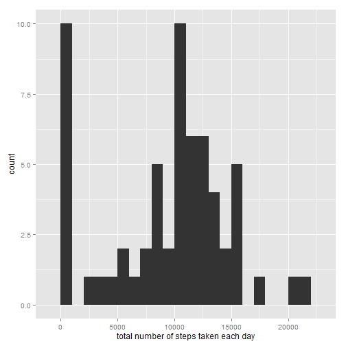

---
output:
  html_document:
    keep_md: yes
---
# Reproducible Research: Peer Assessment 1

## Loading and preprocessing the data
(1) The following is the code to (a) load the data, and (b) process/transform the data:

```r
unzip(zipfile="activity.zip")
```

```
## Warning in unzip(zipfile = "activity.zip"): error 1 in extracting from zip
## file
```

```r
data <- read.csv("activity.csv")
```

## What is mean total number of steps taken per day?
(1) The following is the histogram of the total number of steps taken each day (and the associated code
used to produce it):

```r
library(ggplot2)
total.steps <- tapply(data$steps, data$date, FUN=sum, na.rm=TRUE)
qplot(total.steps, binwidth=1000, xlab="total number of steps taken each day")
```

 

(2) The following is the calculation and report for the **mean** and **median** total number of steps taken per day:

```r
mean(total.steps, na.rm=TRUE)
```

```
## [1] 9354.23
```

```r
median(total.steps, na.rm=TRUE)
```

```
## [1] 10395
```

## What is the average daily activity pattern?
(1) The following is a time series plot of the 5-minute interval (x-axis) and the average number of steps taken, averaged across all days (y-axis):

```r
library(ggplot2)
averages <- aggregate(x=list(steps=data$steps), by=list(interval=data$interval),
                      FUN=mean, na.rm=TRUE)
ggplot(data=averages, aes(x=interval, y=steps)) +
    geom_line() +
    xlab("5-minute interval") +
    ylab("average number of steps taken")
```

 

(2) The following is the calculation to show the 5-minute interval, on average across all the days in the dataset, that contains the maximum number of steps:

```r
averages[which.max(averages$steps),]
```

```
##     interval    steps
## 104      835 206.1698
```

## Imputing missing values
There are a number of days/intervals where there are missing values (coded as `NA`). The presence of missing 
days may introduce bias into some calculations or summaries of the data.

(1) The following is the calculation and report of the total number of missing values in the dataset (i.e. 
the total number of rows with `NA`s):

```r
missing <- is.na(data$steps)
table(missing)
```

```
## missing
## FALSE  TRUE 
## 15264  2304
```
(2) We need to devise a strategy for filling in all of the missing values in the dataset.
```
Here, let's use the **mean for the 5-minute interval** for the missing values. 
```
(3) The following is the code used to create a new dataset that is equal to the original dataset but with the 
missing data filled in:

```r
fill.value <- function(steps, interval) {
    filled <- NA
    if (!is.na(steps))
        filled <- c(steps)
    else
        filled <- (averages[averages$interval==interval, "steps"])
    return(filled)
}
filled.data <- data
filled.data$steps <- mapply(fill.value, filled.data$steps, filled.data$interval)
```

(4) The following is a histogram of the total number of steps taken each day:

```r
total.steps <- tapply(filled.data$steps, filled.data$date, FUN=sum)
qplot(total.steps, binwidth=1000, xlab="total number of steps taken each day")
```

 

The following is the calculation and report of the **mean** and **median** total number of steps taken per day:

```r
mean(total.steps)
```

```
## [1] 10766.19
```

```r
median(total.steps)
```

```
## [1] 10766.19
```
(a) Do these values differ from the estimates from the first part of the assignment? 
```
The values differ from the estimates from the first part of the assignment, in that the mean and median values 
are higher after imputing the missing data.
```
```
The reason for this is that in the original data, there are some days with `steps` values `NA` for 
any `interval`. The total number of steps taken in such days are set to 0s by default. 
```
(b) What is the impact of imputing missing data on the estimates of the total daily number of steps?
```
The impact of imputing the missing data on the estimates of the total daily number of steps is that after 
replacing missing `steps` values with the mean `steps` of the associated `interval` value, the 0 values are 
removed from the histogram of total number of steps taken each day.
```

## Are there differences in activity patterns between weekdays and weekends?
(1) The following code is used to create a new factor variable in the dataset with two levels ("weekday" 
and "weekend") indicating whether a given date is a weekday or weekend day:

```r
weekday.or.weekend <- function(date) {
    day <- weekdays(date)
    if (day %in% c("Monday", "Tuesday", "Wednesday", "Thursday", "Friday"))
        return("weekday")
    else if (day %in% c("Saturday", "Sunday"))
        return("weekend")
    else
        stop("invalid date")
}
filled.data$date <- as.Date(filled.data$date)
filled.data$day <- sapply(filled.data$date, FUN=weekday.or.weekend)
```
(2) The following is a panel plot containing a time series plot of the 5-minute interval (x-axis) and the
average number of steps taken, averaged across all weekday days or weekend days (y-axis):

```r
averages <- aggregate(steps ~ interval + day, data=filled.data, mean)
ggplot(averages, aes(interval, steps)) + geom_line() + facet_grid(day ~ .) +
    xlab("5-minute interval") + ylab("Number of steps")
```

 
